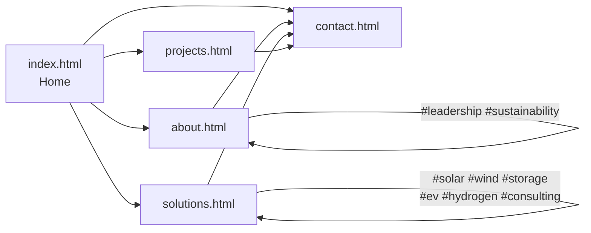
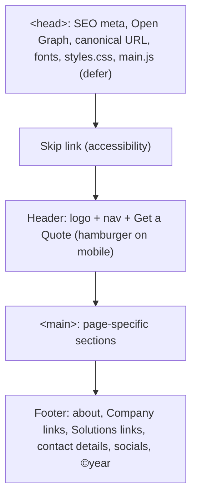
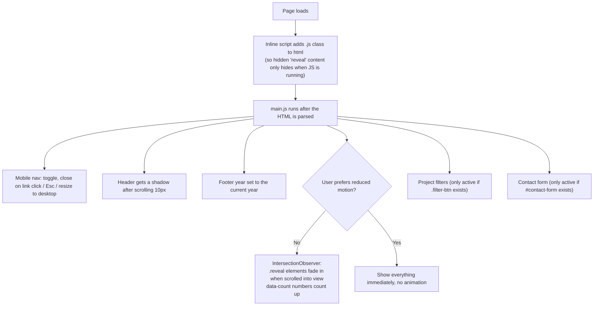
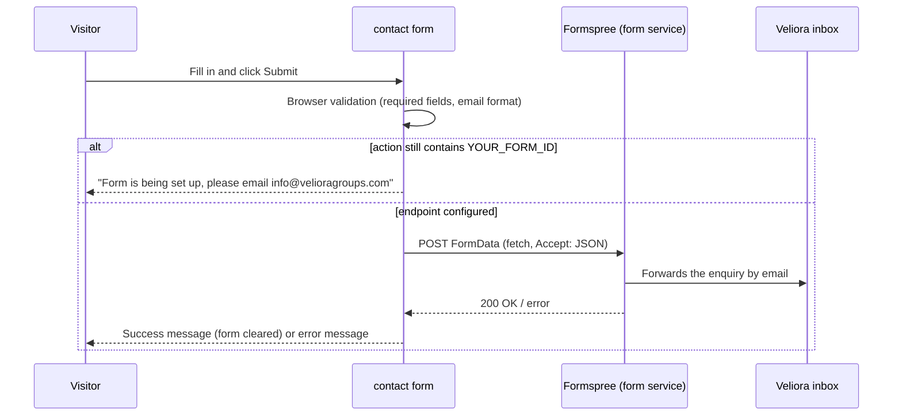

# Veliora Energy Website: How It Works

## What was built

A static, multi-page marketing website for **Veliora Energy** (velioragroups.com). It uses only HTML, CSS and a small amount of JavaScript. There is no framework, no build step and no server code.

```
Veloria Energy/
├── index.html        Home page
├── about.html        Company story, vision/mission, directors, timeline, ESG
├── solutions.html    Detail for each solution, sectors served, financing models
├── projects.html     (not yet created) project portfolio with category filters
├── contact.html      (not yet created) enquiry form, email, phone, address
├── css/styles.css    One stylesheet shared by every page
├── js/main.js        One script shared by every page
└── assets/logo.svg   Logo, also used as the browser tab icon
```

> **Status:** `projects.html` and `contact.html` are already linked from the navigation, and their CSS and JS are already written, but the HTML pages themselves are still missing. Until they exist, those links will show a 404.

## Page map



The whole site is designed to lead visitors to **Contact / Get a Quote**. Every page has a call-to-action (CTA) banner, and the header has a "Get a Quote" button on every page.

## What each page contains

| Page | Sections (top to bottom) | Purpose |
|------|--------------------------|---------|
| **Home** | Hero with animated wind/solar illustration, key-figure counters, about intro, 6 solution cards, vision + 4-step process, "Why Veliora", CTA | First impression: what we do, why it matters, what to do next |
| **About** | Page hero, Who We Are, Vision / Mission / Promise, Core Values, **Directors** (`#leadership`), Timeline, Sustainability & ESG (`#sustainability`), CTA | Build trust in the people and the company |
| **Solutions** | Page hero, 6 alternating detail rows (Solar, Wind, Storage, EV, Hydrogen, Consulting & O&M), Sectors We Power, Financing models (CAPEX / OPEX / PPA), CTA | Explain the offer in depth; the anchors let Home cards link straight to one solution |
| **Projects** *(pending)* | Filterable project cards (`.filter-btn`, `.project-card[data-category]`) | Show proof of work |
| **Contact** *(pending)* | Form `#contact-form`, contact details | Capture leads |

## Shared page layout

Each HTML page repeats the same header and footer so the site works without any build tool or server-side includes:



## What the JavaScript does ([js/main.js](js/main.js))



### Contact form flow



## Styling ([css/styles.css](css/styles.css))

- **Design tokens** at the top (`:root`): greens, lime and sun-yellow accents, radius, shadows, fonts. To change the brand colours, edit these variables and every page updates.
- **Fonts:** Poppins for headings, Inter for body text (Google Fonts).
- **Reusable blocks:** `.btn`, `.card`, `.grid-3`, `.grid-4`, `.split` / `.split.reverse`, `.section`, `.section-alt`, `.section-dark`, `.cta`, `.page-hero`, `.media-placeholder`.
- **Responsive breakpoints:** 1024px (tablet), 900px (hamburger menu), 600px (phone).
- **Reduced motion:** animations are switched off for users who ask for it in their OS settings.

## Where to add real content later

| What | Where | How |
|------|-------|-----|
| Key figures (MW, projects, CO₂, countries) | [index.html](index.html), `.stats` section | Change the `data-count`, `data-suffix` and the text in each `.stat-number` |
| Director names, roles, bios, photos | [about.html](about.html), `#leadership` | Replace "Director Name" and swap the icon for `` |
| Timeline years and milestones | [about.html](about.html), "Our Journey" | Edit each timeline item |
| Photos | Any `.media-placeholder` block | Replace the `<div class="media-placeholder">` with an `` |
| Phone, address, social links | Footer on **every** page | Replace `+00 000 000 0000`, "Office Address, City, Country" and the `href="#"` links |
| Contact form endpoint | `contact.html` (when created) | Replace `YOUR_FORM_ID` in the form's `action` with the real Formspree ID |

## How to preview locally

Open `index.html` in a browser. Nothing needs to be installed.
